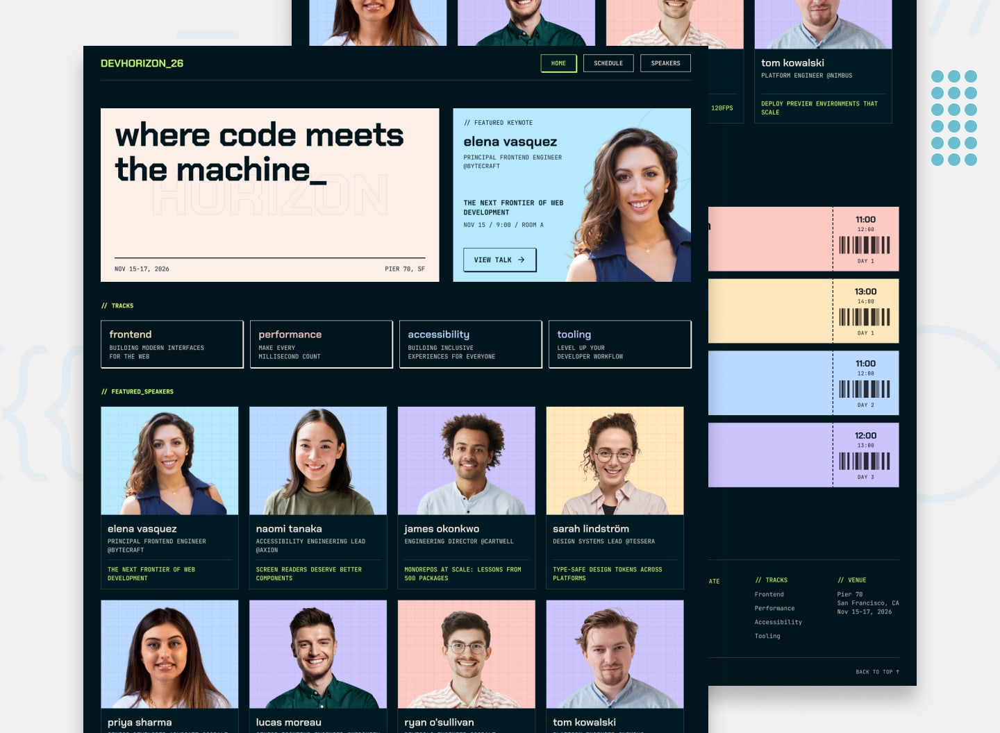

# Frontend Mentor - Tech Conference Site



## Welcome! 👋

Thanks for purchasing this premium Frontend Mentor coding challenge.

[Frontend Mentor](https://www.frontendmentor.io) challenges help you improve your coding skills by building realistic projects. These premium challenges are perfect portfolio pieces, so please feel free to use what you create in your portfolio to show others.

**To do this challenge, you need a strong understanding of HTML, CSS, and JavaScript.**

## The challenge

Your challenge is to build out this multi-page tech conference site and get it looking as close to the design as possible.

You can use any tools you like to help you complete the challenge. So if you've got something you'd like to practice, feel free to give it a go.

Your users should be able to:

### Home Page

- See the conference brand, tagline, dates, and venue in the hero section
- View the featured keynote, including the speaker, talk title, and session time
- Browse the conference tracks with their names and descriptions
- See a grid of featured speakers, each card linking through to the speakers page
- Browse the schedule highlights with key talks pulled from across the three days
- Use call-to-action links to navigate to the full schedule and speakers pages

### Schedule

- View the full conference schedule organised by day
- Filter the schedule by day (Day 01, Day 02, or Day 03)
- Filter the schedule by track (Frontend, Performance, A11y, or Tooling), with multiple track filters active at once
- Combine day and track filters to narrow down the list
- Expand and collapse each talk to show or hide its description and location
- Save talks to a personal "My Schedule" using the bookmark button on each talk
- Filter the schedule to show only saved talks via the "My Schedule" filter
- Clear all active filters with the "Clear" button

### Speakers

- Browse all speakers in a responsive card grid, each card showing the speaker's photo, name, role, company, and the title of their talk
- Open a modal for any speaker to read their full bio and see their session
- Save the speaker's talk to "My Schedule" directly from inside the modal
- Close the modal by clicking the close button, clicking the overlay, or pressing Escape

### UI & Accessibility

- View the optimal layout for the interface depending on their device's screen size
- See hover and focus states for all interactive elements on the page
- Navigate the entire site using only their keyboard

### Data Model

A `data.json` file is provided with the conference content used across all three pages. It has four top-level keys: `conference`, `tracks`, `speakers`, and `talks`.

```json
{
    "conference": {
        "name": "DevHorizon 2026",
        "brandCode": "DEVHORIZON_26",
        "tagline": "where code meets the machine_",
        "startDate": "2026-11-15",
        "endDate": "2026-11-17",
        "location": {
            "venue": "Pier 70",
            "city": "San Francisco",
            "cityAbbreviation": "SF",
            "state": "CA"
        }
    },
    "tracks": [
        {
            "id": "tr_1",
            "name": "Frontend",
            "description": "Building modern interfaces for the web",
            "color": "#FFE6BA"
        }
    ],
    "speakers": [
        {
            "id": "sp_0",
            "name": "Elena Vasquez",
            "role": "Principal Frontend Engineer",
            "company": "Bytecraft",
            "avatar": "./assets/images/avatar-elena-vasquez.webp",
            "bio": "Elena has spent the last decade...",
            "featured": true
        }
    ],
    "talks": [
        {
            "id": "tk_0",
            "title": "The Next Frontier of Web Development",
            "speakerId": "sp_0",
            "day": 1,
            "trackId": "tr_0",
            "startTime": "9:00",
            "endTime": "10:00",
            "location": "Room A",
            "description": "The opening keynote...",
            "highlighted": false
        }
    ]
}
```

#### Conference properties

| Property    | Type   | Description                                                            |
| ----------- | ------ | ---------------------------------------------------------------------- |
| `name`      | string | Display name of the conference                                         |
| `brandCode` | string | Logo/brand code shown in the header and footer (e.g., `DEVHORIZON_26`) |
| `tagline`   | string | Hero heading text                                                      |
| `startDate` | string | First day of the conference in `YYYY-MM-DD` format                     |
| `endDate`   | string | Last day of the conference in `YYYY-MM-DD` format                      |
| `location`  | object | Venue and city details                                                 |

#### Track properties

| Property      | Type   | Description                                                                                         |
| ------------- | ------ | --------------------------------------------------------------------------------------------------- |
| `id`          | string | Unique identifier for each track                                                                    |
| `name`        | string | Display name of the track                                                                           |
| `description` | string | Short description shown on the home page tracks section                                             |
| `color`       | string | Hex color used for the track's background on talk cards, speaker cards, and the modal speaker photo |

The `Keynote` track is treated as a special track. It powers the featured keynote on the home page and should be excluded from the tracks listings shown in the home page tracks section, the footer tracks list, and the schedule track filters.

#### Speaker properties

| Property   | Type    | Description                                                             |
| ---------- | ------- | ----------------------------------------------------------------------- |
| `id`       | string  | Unique identifier for each speaker                                      |
| `name`     | string  | Speaker's full name                                                     |
| `role`     | string  | Speaker's job title                                                     |
| `company`  | string  | Company the speaker works at                                            |
| `avatar`   | string  | Relative path to the speaker's avatar image                             |
| `bio`      | string  | Full bio shown in the speaker modal                                     |
| `featured` | boolean | Whether to include this speaker in the home page Featured Speakers grid |

#### Talk properties

| Property      | Type    | Description                                                                             |
| ------------- | ------- | --------------------------------------------------------------------------------------- |
| `id`          | string  | Unique identifier for each talk                                                         |
| `title`       | string  | Talk title                                                                              |
| `speakerId`   | string  | The `id` of the speaker giving this talk                                                |
| `day`         | number  | Conference day the talk takes place on (`1`, `2`, or `3`)                               |
| `trackId`     | string  | The `id` of the track this talk belongs to                                              |
| `startTime`   | string  | Start time in 24-hour `H:MM` format                                                     |
| `endTime`     | string  | End time in 24-hour `H:MM` format                                                       |
| `location`    | string  | Room the talk is held in                                                                |
| `description` | string  | Talk description shown when the user expands a schedule item or opens the speaker modal |
| `highlighted` | boolean | Whether to include this talk in the home page Schedule Highlights section               |

### Data Persistence

The list of talks a user has saved to "My Schedule" should persist across browser sessions. When a user saves or unsaves a talk, that change should be remembered when they close and reopen the site. `localStorage` is a natural fit for this — there's no need for user accounts on a conference site.

### Optional: Practice with a headless CMS

A tech conference site doesn't need user accounts or a custom database, but it's a great fit for practising **content management**. If you want to take this challenge a step further, try moving the contents of `data.json` into a headless CMS and pulling it into your site on a read-only basis.

Some popular options to explore:

- [Sanity](https://www.sanity.io/)
- [Contentful](https://www.contentful.com/)
- [Storyblok](https://www.storyblok.com/)
- [Payload](https://payloadcms.com/)
- [Strapi](https://strapi.io/)

This is a realistic setup for the kind of marketing or events site you'd build in the wild — the editorial team owns the content in the CMS, and your code's job is to fetch it, model it, and render it. You'll get practice modelling content types (conference, tracks, speakers, talks), handling references between them (a talk references a speaker and a track), and choosing between build-time vs. runtime data fetching.

### Expected Behaviors

- **Featured keynote**: The home page hero pairs with a featured keynote card showing the talk in the `Keynote` track and the speaker giving it
- **Track colors**: Each track's `color` is used as the background for talk cards on the home page schedule highlights, the schedule list, the featured keynote card, the featured speaker cards, and the speaker photo background inside the modal. Speaker cards use the color of the track for the talk that speaker is giving
- **Schedule defaults**: On first load, the schedule page filters to Day 01 with no active track filters
- **Track links**: When a user clicks a track from the home page tracks section or the footer tracks list, they should be taken to the schedule page with that track pre-filtered on Day 01. Every track has at least one Day 01 talk, so the user always lands on a non-empty list and can switch days from there
- **Filter combinations**: Day filters are single-select, track filters are multi-select. The schedule list shows talks that match the selected day AND any of the selected tracks
- **My Schedule filter**: When active, only talks the user has saved are shown. It can be combined with the day and track filters
- **Show details**: Talk details (description and location) start collapsed and expand inline when the user toggles "Show details"
- **Empty filter result**: If the active filter combination produces no talks, show a friendly message rather than an empty list
- **Mobile navigation**: On smaller breakpoints, the primary navigation collapses behind a menu trigger that toggles the nav links open and closed

### Modal Behavior

- The speaker modal opens when the user activates a speaker card on the speakers page
- Close the modal when clicking the close button, clicking the overlay, or pressing Escape
- Manage focus appropriately when opening and closing the modal so keyboard users aren't lost

### Accessibility

- Ensure keyboard navigation works for all interactive elements, including the schedule filters, talk expand/collapse toggles, save buttons, and the speaker modal
- Provide visible focus styles that match the brand's accent color
- Use appropriate semantic HTML for the navigation, lists of talks and speakers, and modal dialog
- Provide screen reader announcements for dynamic changes (e.g., a talk being saved or unsaved, the schedule list updating after a filter change)

### A note about the conference dates

The `data.json` file sets the conference for **November 15–17, 2026**. If you're starting this challenge after that date and want the site to feel like an upcoming event, feel free to bump the year on `conference.startDate` and `conference.endDate`. The footer copyright (`2026 DevHorizon. All rights reserved.`) is also worth updating in your HTML if you do — it's intentionally hardcoded rather than data-driven, since the brand text in the copyright doesn't map cleanly onto any single field in `data.json`. Everything else — speakers, talks, track assignments — is independent of the year, so a simple year shift is all you need.

### Want some support on the challenge?

[Join our community](https://www.frontendmentor.io/community) and ask questions in the **#help** channel.

## Where to find everything

Your task is to build out the project to the Figma design file provided. You can download the design file on the platform. **Please be sure not to share it with anyone else.** The design download comes with a `README.md` file as well to help you get set up.

All the required assets for this project are in the `/assets` folder. The images are already exported for the correct screen size and optimized. Some are reusable at multiple screen sizes. So if you don't see an image in a specific folder, it will typically be in another folder for that page.

We also include variable and static font files for the required fonts for this project. You can choose to either link to Google Fonts or use the local font files to host the fonts yourself. Note that we've removed the static font files for the font weights that aren't needed for this project.

The design system in the design file will give you more information about the various colors, fonts, and styles used in this project. Our fonts always come from [Google Fonts](https://fonts.google.com/).

## Using AI coding assistants

We've included two files to help you if you're using AI coding assistants (like Claude, GitHub Copilot, Cursor, etc.) while working on this challenge:

- `AGENTS.md` - Contains detailed instructions for AI assistants on how to help you with this challenge. It's tailored to this challenge's difficulty level, so the AI will provide guidance appropriate to your learning stage—offering more support for beginner challenges and encouraging more independence on advanced ones.
- `CLAUDE.md` - A pointer file that directs Claude-based tools to the AGENTS.md instructions.

**How to use them:** You don't need to do anything! These files are automatically detected by most AI coding tools. The AI will read them and adjust its behavior to be a better learning partner—guiding you toward solutions rather than just giving you the answers.

**Note:** These files are designed to help you _learn_, not to do the work for you. The AI is instructed to ask questions, give hints, and explain concepts rather than writing complete solutions.

## Building your project

Feel free to use any workflow that you feel comfortable with. Below is a suggested process, but do not feel like you need to follow these steps:

1. Separate the `starter-code` from the rest of this project and rename it to something meaningful for you. Initialize the codebase as a public repository on [GitHub](https://github.com/). Creating a repo will make it easier to share your code with the community if you need help. If you're not sure how to do this, [have a read-through of this Try Git resource](https://try.github.io/). **⚠️ IMPORTANT ⚠️: There are already a couple of `.gitignore` files in this project. Please do not remove them or change the content of the files. If you create a brand new project, please use the `.gitignore` files provided in your new codebase. This is to avoid the accidental upload of the design files to GitHub. With these premium challenges, please be sure not to share the design files in your GitHub repo. Thanks!**
2. Configure your repository to publish your code to a web address. This will also be useful if you need some help during a challenge as you can share the URL for your project with your repo URL. There are a number of ways to do this, and we provide some recommendations below.
3. Look through the designs to start planning out how you'll tackle the project. This step is crucial to help you think ahead for CSS classes to create reusable styles.
4. Before adding any styles, structure your content with HTML. Writing your HTML first can help focus your attention on creating well-structured content.
5. Write out the base styles for your project, including general content styles, such as `font-family` and `font-size`.
6. Start adding styles to the top of the page and work down. Only move on to the next section once you're happy you've completed the area you're working on.

## Deploying your project

As mentioned above, there are many ways to host your project for free. Our recommended hosts are:

- [GitHub Pages](https://pages.github.com/)
- [Vercel](https://vercel.com/)
- [Netlify](https://www.netlify.com/)

You can host your site using one of these solutions or any of our other trusted providers. [Read more about our recommended and trusted hosts](https://www.frontendmentor.io/guides/hosting-your-solution).

## Create a custom `README.md`

We strongly recommend overwriting this `README.md` with a custom one. We've provided a template inside the [`README-template.md`](./README-template.md) file in this starter code.

The template provides a guide for what to add. A custom `README` will help you explain your project and reflect on your learnings. Please feel free to edit our template as much as you like.

Once you've added your information to the template, delete this file and rename the `README-template.md` file to `README.md`. That will make it show up as your repository's README file.

## Submitting your solution

Submit your solution on the platform for the rest of the community to see. Follow our ["Complete guide to submitting solutions"](https://www.frontendmentor.io/guides/how-to-submit-solutions) for tips on how to do this.

Remember, if you're looking for feedback on your solution, be sure to ask questions when submitting it. The more specific and detailed you are with your questions, the higher the chance you'll get valuable feedback from the community.

**⚠️ IMPORTANT ⚠️: With these premium challenges, please be sure not to upload the design files to GitHub when you're submitting to the platform and sharing it around. If you've created a brand new project, the easiest way to do that is to copy across the `.gitignore` provided in this starter project.**

## Sharing your solution

There are multiple places you can share your solution:

1. Share your solution page in the **#finished-projects** channel of our [community](https://www.frontendmentor.io/community).
2. Share on [X (formerly Twitter)](https://x.com/frontendmentor) and mention **@frontendmentor**, including the repo and live URLs in your post. We'd love to take a look at what you've built and help share it around.
3. Share your solution on [LinkedIn](https://www.linkedin.com/company/frontend-mentor/).
4. Blog about your experience building your project. Writing about your workflow, technical choices, and talking through your code is a brilliant way to reinforce what you've learned. Great platforms to write on are [dev.to](https://dev.to/), [Hashnode](https://hashnode.com/), and [CodeNewbie](https://community.codenewbie.org/).

We provide templates to help you share your solution once you've submitted it on the platform. Please do edit them and include specific questions when you're looking for feedback.

The more specific you are with your questions the more likely it is that another member of the community will give you feedback.

## Got feedback for us?

We love receiving feedback! We're always looking to improve our challenges and our platform. So if you have anything you'd like to mention, please email hi[at]frontendmentor[dot]io.

**Have fun building!** 🚀
